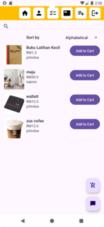

# UTeM-BAZAAR

A simple E-commerce app specifially for my university that i built for my final year project.This is never meant to be used or sell as a real application.

## Features

* Cart System: Users can add item to cart and edit item quantity.
* Checkout: User need to enter address 
* Seller Panel : Seller can upload their product
* Filter : Searchbar have filter by price or alphabet.
  

## Installation
